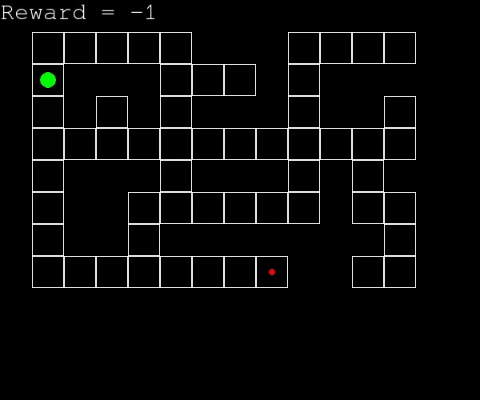

# TaxiProblem
-  Language : Python 3.6

- Objective : solve the taxi problem with reinforcement learning (MAXQ value fonction decomposition).

- For the moment, the taxi (green circle) has just to reach its target (the red small circle) as shown below. Only plain Q-Learning is implemented for the moment

<p align="center">

</p>

- How to use it ? Just run the main file
```
python3 main.py
```
You can change the variables in the file
```
variables.py
```
and the geometry of the domain by changing the variable

```
domain_file = "example_domain_3"
```
which is a path to the file *example_domain_3* in the folder */domain*.
